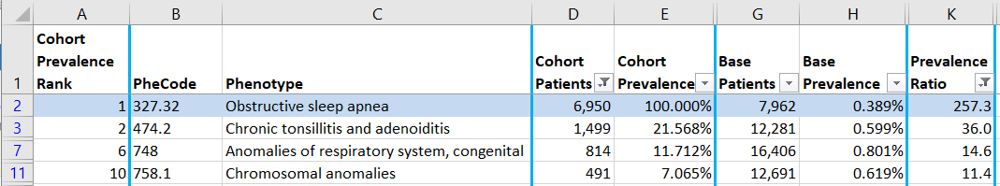
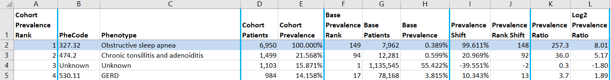

# Placeholder for Pediatric Sleep Apnea paper supplement

**Supplement Tables** (Excel Files)

* **Table 1**. Obstructive-Sleep-Apnea-Comorbidity-Base-Comparison.xlsx [919 data rows]

* **Table 2**. NonObstructive-Sleep-Apnea-Comorbidity-Base-Comparison.xlsx [484 data rows]

* **Table 3**. Other-Sleep-Apnea-Comorbidity-Base-Comparison.xlsx [534 data rows]

## Filtering

These files are filtered to show phenotype comorbidities with Prevalence Ratio >= 10 and Cohort Patients >= 20 to be supplement tables 1-3. Excel can be used to explore other filtering.

. . .

## No Filters

In Excel select *Data* | *Filter* to remove filters. The data will appear in descending cohort prevalence order (ascending prevalence rank order).

This version of the files was used to create Tables 4-6 in the paper.

## Hidden Columns

Excel hidden columns used to explore prevalence comparisons:

* Base Prevalence Rank
* Prevalence Shift
* Prevalence Rank Shift
* Log2 Prevalene Ratio

In Excel:  Select whole table | Rght click on spreadsheet header row | Select **Unhide** to view all columns.

. . .

**Note**:  While three digits are shown after decimal point in prevalences, not all digits may be significant. This is a practical compromise to avoid using scientific notation in only some cells to show proper significant digits.
